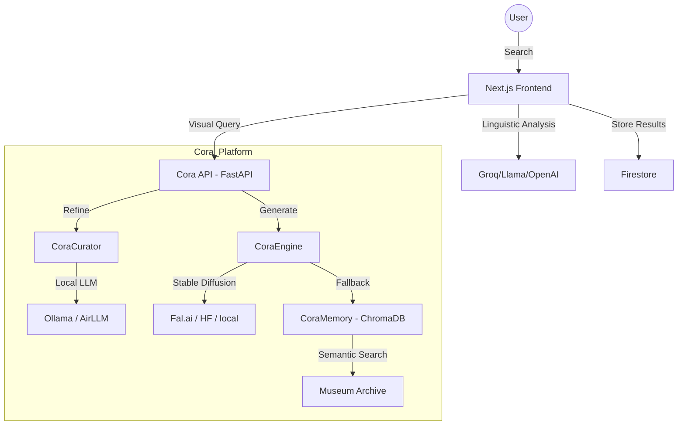

# ARCHITECTURE.md

## System Overview

Le Clef Mot follows a distributed intelligence architecture, separating linguistic analysis (Web) from visual generation (Cora).

## Data Flow

## Folder Structure

- `web/`: Next.js application (Frontend & Edge Logic).
- `cora/`: Visual Etymology Engine (Python/FastAPI).
  - `cora_curator.py`: Prompt refinement (Ollama, AirLLM, HF).
  - `cora_engine.py`: Image generation and fallbacks.
  - `cora_memory.py`: Semantic archive management.
  - `app.py`: Unified Gradio UI + FastAPI endpoint.
- `flowise/`: LangChain/Flowise experimental prompts and logic.
- `docs/`: Integration and API specifications.

## Memory & Caching

- **Firestore**: Primary cache for generated etymology data.
- **ChromaDB**: Vector store for image-prompt pairings (Inside Cora).
- **Pinecone**: Global vector search for semantic word mapping.
